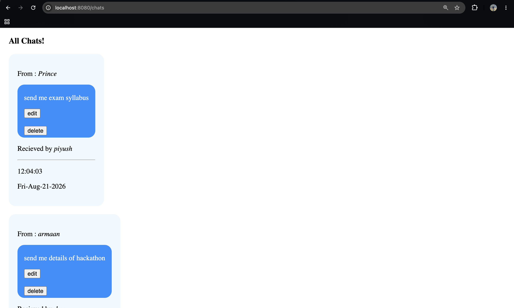
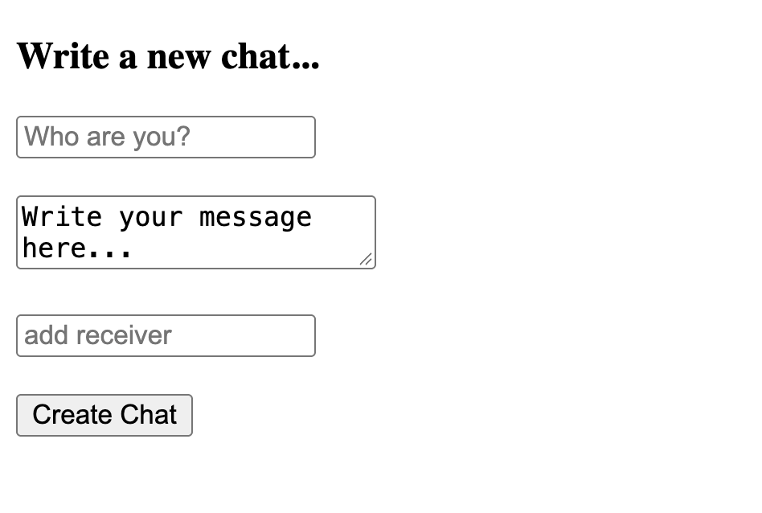
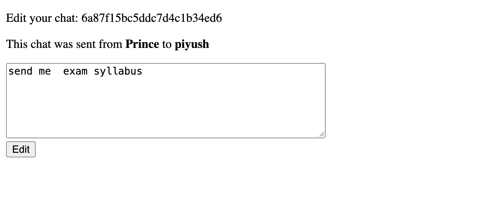

# 💬 Chat Database App (Mini WhatsApp)

A mini WhatsApp-style chat application built with **Node.js, Express, MongoDB and EJS**. Messages are stored in a MongoDB database and the app supports full **CRUD** operations: create, read, update and delete chats.

## ✨ Features

- 📋 View all chats as chat bubbles, showing sender, receiver, time and date
- ✍️ Write a new chat (sender, message, receiver)
- ✏️ Edit the text of an existing message
- 🗑️ Delete a message
- ✅ Schema validation with Mongoose (sender and receiver required, message limited to 50 characters)
- 🌱 Seed script to fill the database with sample chats

## 📸 Screenshots

### All Chats


### Create a New Chat


### Edit a Chat


## 🛠️ Tech Stack

| Layer | Technology |
|-------|------------|
| Backend | Node.js, Express 5 |
| Database | MongoDB, Mongoose 9 |
| Templating | EJS |
| Forms | method-override (lets HTML forms send PUT and DELETE requests) |
| Styling | Plain CSS |

## 📁 Project Structure

```
Chat-database-app/
├── models/
│   └── chat.js        # Mongoose schema and model
├── public/
│   └── style.css      # Chat bubble styling
├── views/
│   ├── index.ejs      # All chats page
│   ├── new.ejs        # New chat form
│   └── edit.ejs       # Edit chat form
├── screenshots/       # Images used in this README
├── index.js           # Express server, database connection and routes
├── init.js            # Seeds the database with sample chats
├── package.json
└── package-lock.json
```

## 🗄️ Chat Schema

| Field | Type | Rules |
|-------|------|-------|
| `from` | String | Required |
| `to` | String | Required |
| `msg` | String | Maximum 50 characters |
| `created_at` | Date | Required |

Database name: `whatsapp` (collection: `chats`)

## 🔗 Routes

| Method | Route | Description |
|--------|-------|-------------|
| GET | `/` | Simple check that the server is running |
| GET | `/chats` | Show all chats |
| GET | `/chats/new` | Show the new chat form |
| POST | `/chats` | Create a new chat |
| GET | `/chats/:id/edit` | Show the edit form for one chat |
| PUT | `/chats/:id` | Update the message of a chat |
| DELETE | `/chats/:id` | Delete a chat |

## 🚀 Getting Started

### Prerequisites

- [Node.js](https://nodejs.org/)
- [MongoDB](https://www.mongodb.com/try/download/community) installed and running locally on `mongodb://127.0.0.1:27017`

### Installation

```bash
# 1. Clone the repository
git clone https://github.com/PrinceSagwal/Chat-database-app.git

# 2. Go into the project folder
cd Chat-database-app

# 3. Install dependencies
npm install
```

### Seed the database (optional)

This inserts 4 sample chats into the `whatsapp` database. Run it **once**, then press `Ctrl + C` to stop it (running it again adds duplicates).

```bash
node init.js
```

### Start the server

```bash
node index.js
```

Or, for auto-restart while developing:

```bash
npx nodemon index.js
```

Open **http://localhost:8080/chats** in your browser.

## 📖 How It Works

1. `index.js` connects to MongoDB with Mongoose and starts the Express server on port **8080**.
2. The **index route** loads every chat from the database and renders `index.ejs`.
3. The **new** and **edit** forms submit to the server; `method-override` turns `?_method=PUT` and `?_method=DELETE` into real PUT and DELETE requests.
4. After an update or delete, the app redirects back to `/chats`.

## 🔮 Future Improvements

- User login and authentication
- Real-time messaging with Socket.io
- Conversations grouped by user
- Mobile-friendly responsive design

## 👤 Author

**Prince Sagwal**
GitHub: [@PrinceSagwal](https://github.com/PrinceSagwal)

---
⭐ If you like this project, give it a star!